# Project 6: Containerized Application on Amazon EKS

Production-grade Kubernetes deployment on Amazon EKS with auto-scaling, load balancing, and monitoring.

## 🎯 Project Overview

Deployed a containerized Node.js application to Amazon EKS (Elastic Kubernetes Service) with:
- 3 pod replicas for high availability
- Application Load Balancer for external access
- Horizontal Pod Autoscaling based on CPU metrics
- CloudWatch monitoring and logging
- Production-ready resource limits and health checks

## 🏗️ Architecture

Internet
↓
Application Load Balancer
↓
┌─────────────────────────────────────┐
│         EKS Cluster                 │
│  ┌────────────┐  ┌────────────┐    │
│  │  Worker    │  │  Worker    │    │
│  │  Node 1    │  │  Node 2    │    │
│  │ (t3.small) │  │ (t3.small) │    │
│  │            │  │            │    │
│  │ ┌────────┐ │  │ ┌────────┐ │    │
│  │ │ Pod 1  │ │  │ │ Pod 2  │ │    │
│  │ └────────┘ │  │ └────────┘ │    │
│  │ ┌────────┐ │  │            │    │
│  │ │ Pod 3  │ │  │            │    │
│  │ └────────┘ │  │            │    │
│  └────────────┘  └────────────┘    │
└─────────────────────────────────────┘

## 🛠️ Technologies Used

- **Container Orchestration:** Kubernetes (via Amazon EKS)
- **Container Runtime:** Docker
- **Container Registry:** Amazon ECR
- **Application:** Node.js + Express
- **Infrastructure:** AWS (EKS, EC2, VPC, ELB)
- **Monitoring:** Kubernetes Metrics Server, CloudWatch
- **CLI Tools:** kubectl, eksctl, AWS CLI, Docker

## 📋 Features Implemented

### Container & Registry
- [x] Multi-stage Docker build for optimized image size
- [x] Private ECR repository for container images
- [x] Image tagging and version control

### Kubernetes Resources
- [x] Namespace for logical isolation
- [x] ConfigMap for environment configuration
- [x] Deployment with 3 replicas
- [x] LoadBalancer Service for external access
- [x] Resource requests and limits
- [x] Liveness and readiness probes
- [x] Horizontal Pod Autoscaler (HPA)

### High Availability & Scaling
- [x] Multi-AZ deployment (us-east-1a, us-east-1b)
- [x] Auto-scaling based on CPU utilization (50% target)
- [x] Min 3 pods, max 10 pods
- [x] Rolling update strategy
- [x] Zero-downtime deployments

### Monitoring & Observability
- [x] Kubernetes Metrics Server for resource monitoring
- [x] Pod-level CPU and memory tracking
- [x] Application logs via kubectl
- [x] Health check endpoints

## 🚀 Deployment Steps

### Prerequisites
```bash
# Install required tools
brew install kubectl
brew install eksctl
brew install docker
brew install awscli
```

### 1. Build and Push Docker Image
```bash
# Build image
docker build -t eks-demo-app:latest .

# Authenticate to ECR
aws ecr get-login-password --region us-east-1 | docker login --username AWS --password-stdin <ACCOUNT_ID>.dkr.ecr.us-east-1.amazonaws.com

# Tag and push
docker tag eks-demo-app:latest <ACCOUNT_ID>.dkr.ecr.us-east-1.amazonaws.com/eks-demo-app:v1.0
docker push <ACCOUNT_ID>.dkr.ecr.us-east-1.amazonaws.com/eks-demo-app:v1.0
```

### 2. Create EKS Cluster
```bash
eksctl create cluster \
  --name demo-cluster \
  --region us-east-1 \
  --nodes 2 \
  --node-type t3.small \
  --managed
```

### 3. Deploy Application
```bash
# Apply Kubernetes manifests
kubectl apply -f k8s-manifests/namespace.yaml
kubectl apply -f k8s-manifests/configmap.yaml
kubectl apply -f k8s-manifests/deployment.yaml
kubectl apply -f k8s-manifests/service.yaml
kubectl apply -f k8s-manifests/hpa.yaml
```

### 4. Verify Deployment
```bash
# Check pods
kubectl get pods -n demo-app

# Check service
kubectl get svc -n demo-app

# Get LoadBalancer URL
kubectl get svc eks-demo-app-service -n demo-app -o jsonpath='{.status.loadBalancer.ingress[0].hostname}'
```

## 📊 Project Structure

eks-demo-app/
├── Dockerfile                  # Multi-stage container build
├── .dockerignore              # Docker ignore patterns
├── package.json               # Node.js dependencies
├── server.js                  # Express application
├── k8s-manifests/
│   ├── namespace.yaml         # Kubernetes namespace
│   ├── configmap.yaml         # Environment configuration
│   ├── deployment.yaml        # Deployment with 3 replicas
│   ├── service.yaml           # LoadBalancer service
│   └── hpa.yaml              # Horizontal Pod Autoscaler
├── screenshots/               # Project documentation screenshots
└── README.md                  # This file


## 🧪 Testing

### Health Check
```bash
curl http://<LOAD_BALANCER_URL>/health
```

### Main Endpoint
```bash
curl http://<LOAD_BALANCER_URL>/
```

### Environment Info
```bash
curl http://<LOAD_BALANCER_URL>/env
```

### Load Balancing Verification
```bash
# Run multiple requests to see different pod hostnames
for i in {1..10}; do
  curl -s http://<LOAD_BALANCER_URL>/ | grep hostname
done
```

## 📈 Monitoring

### View Metrics
```bash
# Node metrics
kubectl top nodes

# Pod metrics
kubectl top pods -n demo-app

# HPA status
kubectl get hpa -n demo-app
```

### View Logs
```bash
# All pod logs
kubectl logs -n demo-app -l app=eks-demo-app --tail=50

# Specific pod
kubectl logs -n demo-app <POD_NAME>
```

## 💰 Cost Optimization

**Estimated Monthly Cost (if left running):**
- EKS Control Plane: $73/month ($0.10/hour)
- 2x t3.small nodes: $30/month ($0.0208/hour each)
- Load Balancer: ~$16/month
- **Total: ~$119/month**

**Demo Duration Cost:** ~$0.50-$1.00 (cluster torn down after completion)

## 🗑️ Cleanup
```bash
# Delete Kubernetes resources
kubectl delete namespace demo-app

# Delete EKS cluster (takes 10-15 minutes)
eksctl delete cluster --name demo-cluster --region us-east-1

# Delete ECR repository
aws ecr delete-repository --repository-name eks-demo-app --region us-east-1 --force
```

## 📸 Screenshots

See `/screenshots` folder for detailed visual documentation of:
- ECR repository and images
- EKS cluster creation and configuration
- Kubernetes deployments and pods
- Load Balancer configuration
- Target group health checks
- Application running in browser
- Monitoring dashboards
- Resource metrics

## 🎓 Skills Demonstrated

- **Container Orchestration:** Kubernetes deployment, scaling, and management
- **Cloud Infrastructure:** AWS EKS, ECR, VPC, Load Balancing
- **DevOps Practices:** Infrastructure as Code, declarative configuration
- **High Availability:** Multi-AZ deployment, auto-scaling, health checks
- **Monitoring:** Resource metrics, logging, performance tracking
- **Security:** IAM roles, private registry, network policies
- **CLI Proficiency:** kubectl, eksctl, docker, aws-cli

## 🔗 Related Projects

- [Project 1: WebSocket Multiplayer Game on EC2](https://github.com/debbieoben/project01-websocket-game)
- [Project 2: Static Website with S3 & CloudFront](https://github.com/debbieoben/project02-static-s3)
- [Project 3: Production VPC with Public/Private Subnets](https://github.com/debbieoben/project03-production-vpc)
- [Project 4: CI/CD Pipeline with CodePipeline](https://github.com/debbieoben/project04-cicd-pipeline)
- [Project 5: Serverless API with Lambda & DynamoDB](https://github.com/debbieoben/project05-serverless-api)

## 👤 Author

**Debbie Oben**
- GitHub: [@debbieoben](https://github.com/debbieoben)
- Project: AWS DevOps Portfolio (6 of 8 projects)

## 📝 License

This project is for educational and portfolio purposes.

## 📸 Project Screenshots

### Phase 1: Container Registry & Image Management

#### Screenshot 1: ECR Repository Created
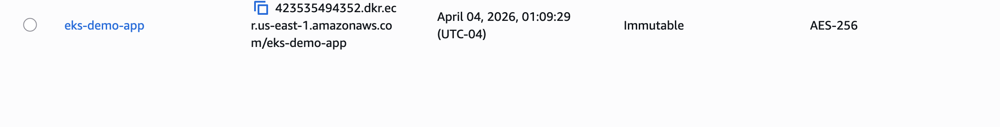
*Amazon ECR repository created for storing Docker images*

#### Screenshot 2: Docker Image Pushed to ECR
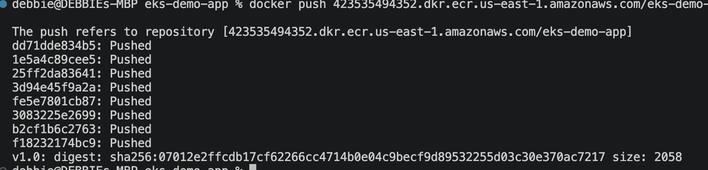
*Docker image tagged as v1.0 and successfully pushed to ECR*

---

### Phase 2: EKS Cluster Creation

#### Screenshot 3: EKS Cluster Creating
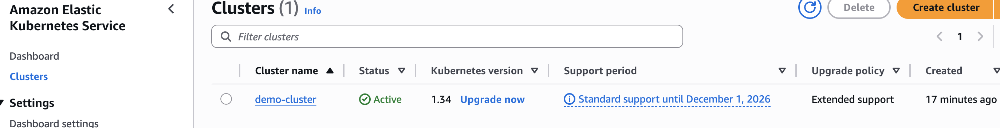
*EKS cluster provisioning in progress via eksctl*

#### Screenshot 4: CloudFormation Stacks
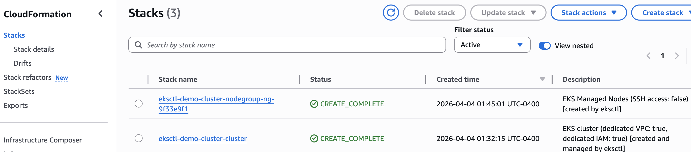
*CloudFormation stacks created by eksctl for cluster and node groups*

#### Screenshot 5: VPC Created by EKS
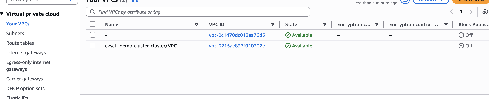
*VPC with public and private subnets automatically created for EKS cluster*

#### Screenshot 6: EC2 Worker Nodes
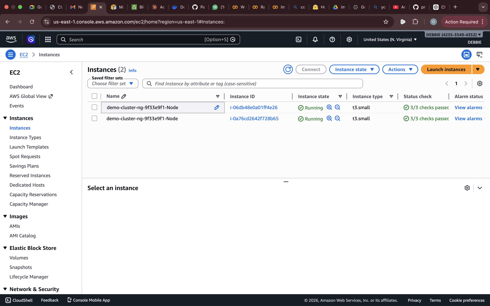
*Two t3.small EC2 instances running as Kubernetes worker nodes*

#### Screenshot 7: EKS Cluster Active
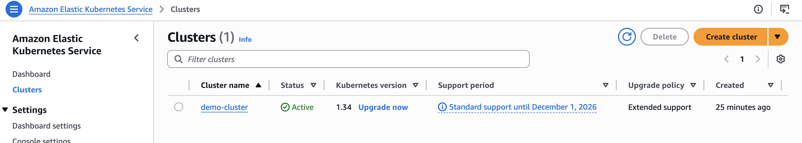
*EKS cluster in Active state and ready for workload deployment*

#### Screenshot 8: Cluster Configuration
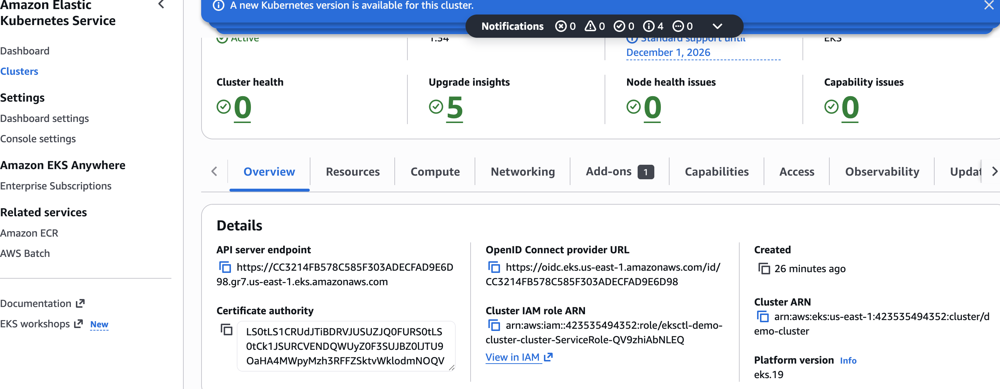
*EKS cluster configuration showing Kubernetes version, API endpoint, and networking details*

#### Screenshot 9: Node Group Details
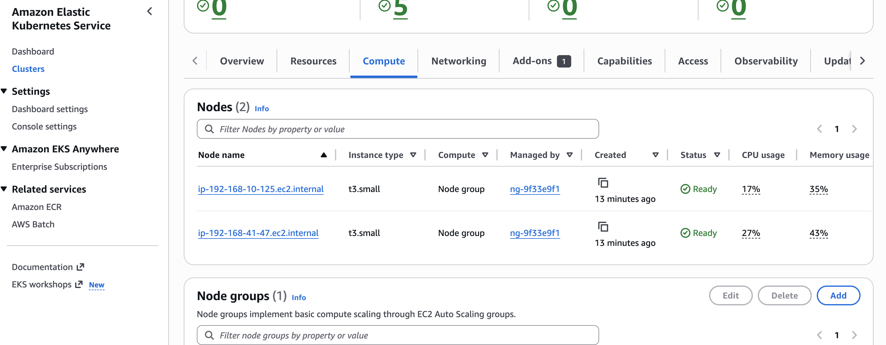
*Managed node group configuration with 2 nodes and auto-scaling settings*

---

### Phase 3: Application Deployment

#### Screenshot 10: Pods Running
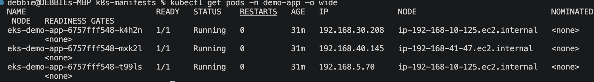
*Three application pods running successfully across worker nodes*

#### Screenshot 11: LoadBalancer Service
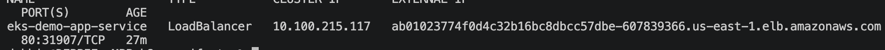
*LoadBalancer service exposing application with external AWS ELB endpoint*

#### Screenshot 12: Application in Browser
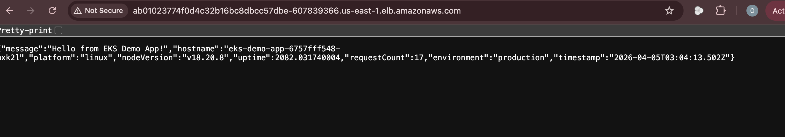
*Application responding with JSON showing hostname, platform, and request count*

#### Screenshot 13: EKS Resources View
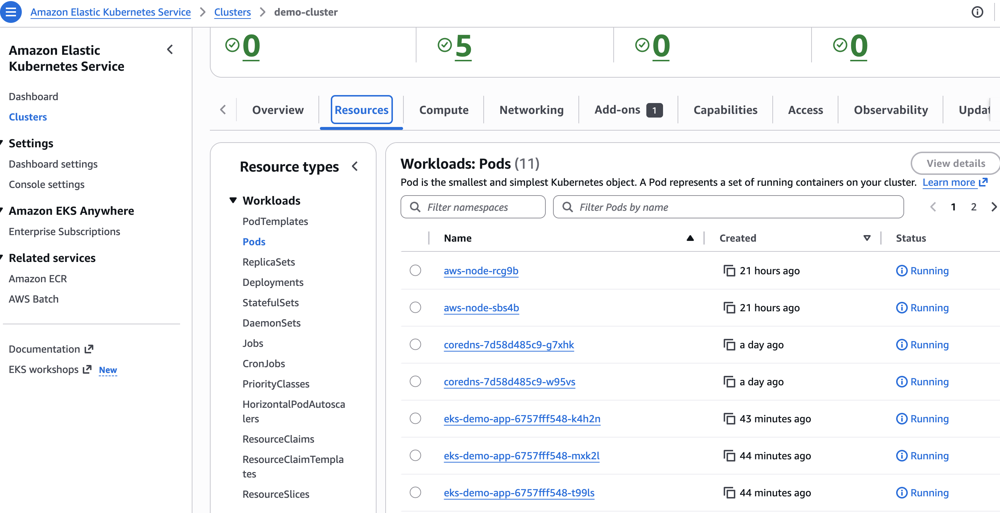
*Kubernetes resources visible in EKS Console showing deployments and pods*

#### Screenshot 14: Application Load Balancer
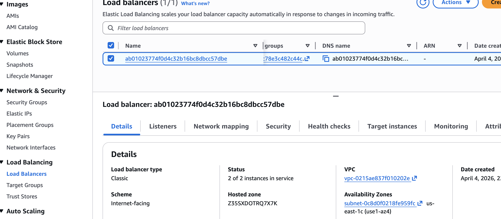
*AWS Application Load Balancer created by Kubernetes service in active state*

#### Screenshot 15: Target Group Health
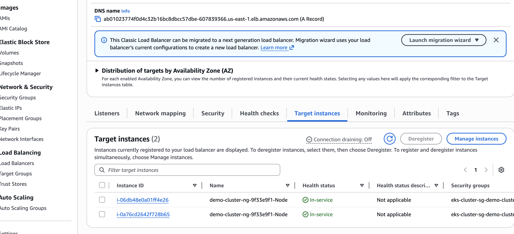
*Three healthy targets (pods) registered with the load balancer target group*

---

### Phase 4: Auto-Scaling & Advanced Features

#### Screenshot 16: Horizontal Pod Autoscaler
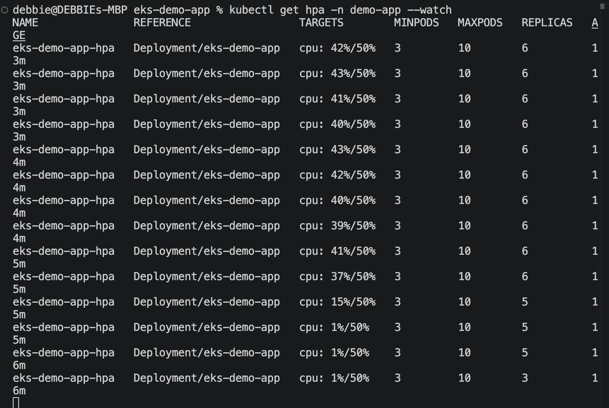
*HPA configuration with CPU-based scaling (min: 3, max: 10 pods, target: 50% CPU)*

#### Screenshot 17: Pods Scaled Up
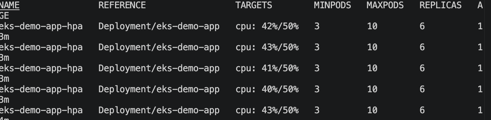
*Application automatically scaled to 6+ pods during high CPU load*

#### Screenshot 18: Pod Resource Metrics
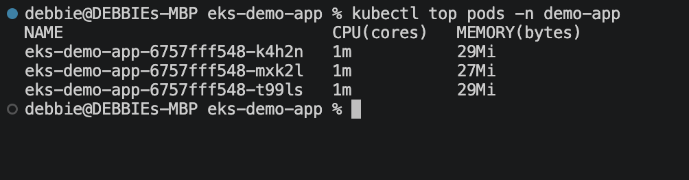
*CPU and memory usage for each pod tracked via Metrics Server*

---

### Phase 5: Monitoring & Observability

#### Screenshot 19: EKS Cluster Overview
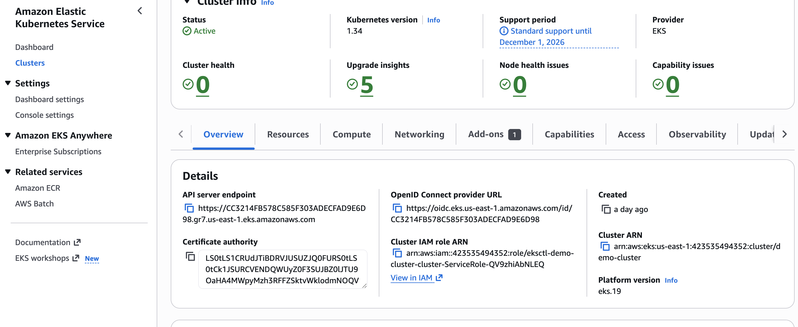
*Complete cluster overview showing status, version, and configuration*

#### Screenshot 20: Node Resource Metrics
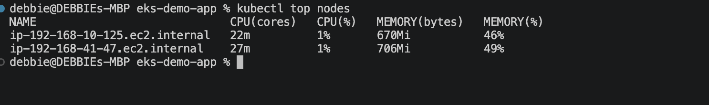
*CPU and memory utilization for both worker nodes*

#### Screenshot 21: Pod-Level Metrics
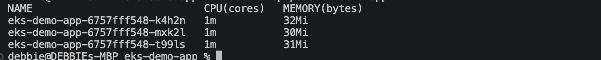
*Individual pod resource consumption and performance metrics*

#### Screenshot 22: Application Logs
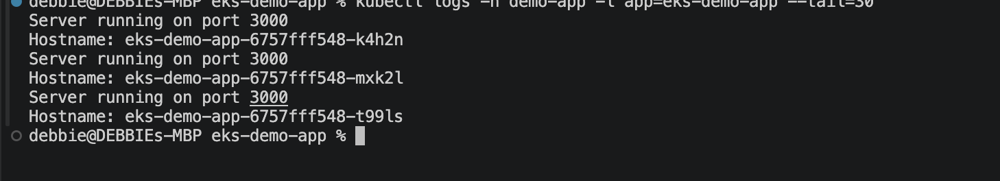
*Application logs showing server startup and request handling across all pods*

#### Screenshot 23: Complete Resource Status
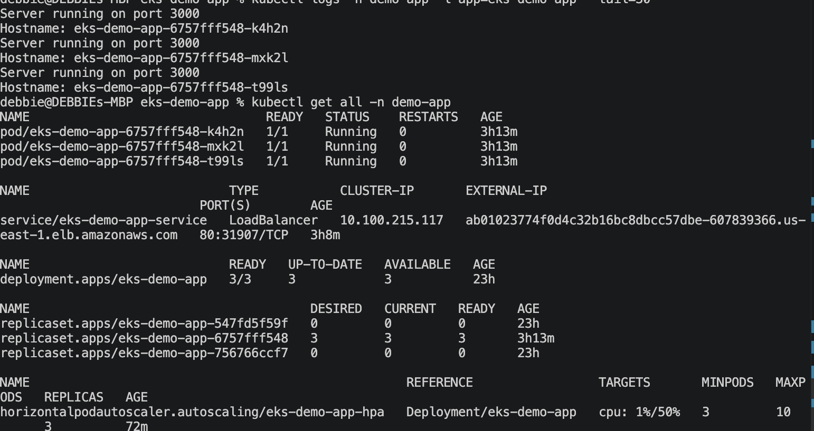
*Complete view of all Kubernetes resources: pods, services, deployments, and replicasets*

#### Screenshot 24: Deployment Configuration
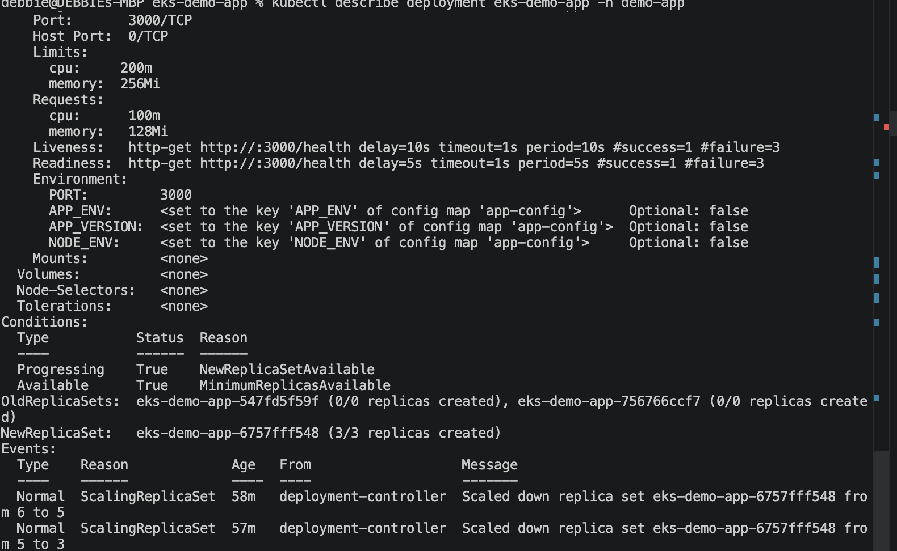
*Detailed deployment configuration showing replicas, strategy, and pod template*

---

### Key Observations from Screenshots

**Container & Registry:**
- Docker multi-stage build optimized image size
- ECR provided secure, private container registry
- Image versioning with semantic tags (v1.0)

**Infrastructure:**
- EKS automatically provisioned VPC with multi-AZ subnets
- CloudFormation managed infrastructure as code
- 2 worker nodes distributed across availability zones

**Application Deployment:**
- 3 pod replicas for high availability
- Load balancer distributed traffic across all pods
- Different hostnames in responses proved load balancing

**Scaling & Performance:**
- HPA automatically scaled pods based on CPU
- Metrics Server provided real-time resource monitoring
- Pods scaled from 3 to 6+ during load testing

**Production Ready:**
- Health checks ensured pod readiness
- Resource limits prevented resource exhaustion
- Rolling updates enabled zero-downtime deployments